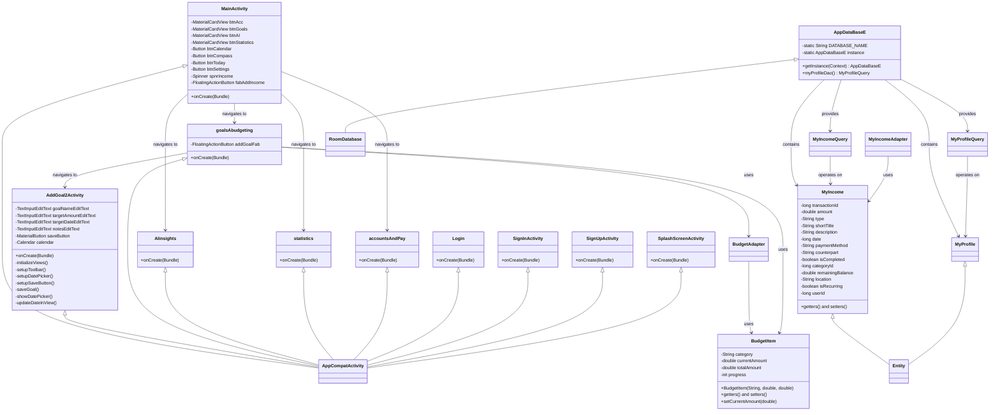

# Elias Final Project - UML Class Diagram

## Architecture Overview

This Android application follows a **Model-View-Controller (MVC)** pattern with the following layers:

### **Presentation Layer (Activities)**
- **MainActivity**: Main dashboard with navigation to core features
- **AddGoal2Activity**: Goal creation form with date picker and validation
- **goalsAbudgeting**: Budget and goals management screen
- **AIinsights**: AI-powered financial insights (placeholder)
- **statistics**: Financial statistics and analytics (placeholder)
- **accountsAndPay**: Account management and payments (placeholder)
- **Authentication**: Login, Sign In, Sign Up, and Splash screens

### **Business Logic Layer**
- **BudgetItem**: Model for budget categories with progress tracking
- **BudgetAdapter**: RecyclerView adapter for displaying budget items
- **MyIncomeAdapter**: RecyclerView adapter for income/expense items

### **Data Layer**
- **AppDataBaseE**: Room database singleton
- **MyIncome**: Entity representing financial transactions
- **MyProfile**: Entity representing user profile data
- **MyIncomeQuery & MyProfileQuery**: DAO interfaces for database operations

### **Key Features Implemented**
1. **Navigation System**: Main dashboard with Material Design cards
2. **Goal Management**: Complete goal creation workflow with validation
3. **Database Architecture**: Room-based persistence layer
4. **Financial Tracking**: Comprehensive transaction model with Arabic documentation
5. **UI Components**: Material Design components throughout

### **Current Status**
- ✅ Core navigation structure
- ✅ Goal creation functionality
- ✅ Database schema and entities
- ✅ Basic UI layouts
- 🔄 AI insights, statistics, and accounts modules need implementation
- 🔄 Data binding and business logic integration needed
