# Elias Final Project - Complete UML Class Diagram

```mermaid
classDiagram
    %% Main Activities
    class MainActivity {
        -MaterialCardView btnAcc
        -MaterialCardView btnGoals
        -MaterialCardView btnAI
        -MaterialCardView btnStatistics
        -Button btnCalendar
        -Button btnCompass
        -Button btnToday
        -Button btnSettings
        -Spinner spnrIncome
        -FloatingActionButton fabAddIncome
        +onCreate(Bundle)
    }

    class AddGoal2Activity {
        -TextInputEditText goalNameEditText
        -TextInputEditText targetAmountEditText
        -TextInputEditText targetDateEditText
        -TextInputEditText notesEditText
        -MaterialButton saveButton
        -Calendar calendar
        +onCreate(Bundle)
        -initializeViews()
        -setupToolbar()
        -setupDatePicker()
        -setupSaveButton()
        -saveGoal()
        -showDatePicker()
        -updateDateInView()
    }

    class AddUserActivity {
        -TextInputEditText nameEditText
        -TextInputEditText emailEditText
        -TextInputLayout nameLayout
        -TextInputLayout emailLayout
        -MaterialButton addButton
        -MaterialCardView mainCard
        -CircularProgressIndicator progressBar
        -static String TAG
        +onCreate(Bundle)
        -initializeViews()
        -setupClickListeners()
        -setupAnimations()
        -createUserAndSave(String, String)
        -saveUserToFirebase(MyUser)
        -handleSuccess()
        -handleError(String)
        -showLoading(boolean)
        -animateSuccess()
        -isValidEmail(String) boolean
    }

    class goalsAbudgeting {
        -FloatingActionButton addGoalFab
        +onCreate(Bundle)
    }

    class AIinsights {
        +onCreate(Bundle)
    }

    class statistics {
        +onCreate(Bundle)
    }

    class accountsAndPay {
        +onCreate(Bundle)
    }

    %% Authentication Activities
    class Login {
        +onCreate(Bundle)
    }

    class SignInActivity {
        +onCreate(Bundle)
    }

    class SignUpActivity {
        -TextInputEditText firstNameEditText
        -TextInputEditText lastNameEditText
        -TextInputEditText emailEditText
        -TextInputEditText passwordEditText
        -TextInputEditText confirmPasswordEditText
        -TextInputLayout firstNameLayout
        -TextInputLayout lastNameLayout
        -TextInputLayout emailLayout
        -TextInputLayout passwordLayout
        -TextInputLayout confirmPasswordLayout
        -Button signUpButton
        -ImageView logoImage
        -FirebaseAuth mAuth
        -ProgressBar progressBar
        -TextView titleText
        -TextView subtitleText
        -TextView loginText
        -static int MIN_PASSWORD_LENGTH
        -static String TAG
        +onCreate(Bundle)
        -attemptSignUp()
        -checkAndSignUp_FB()
        -saveUserProfile(String, String, String, String)
        -checkEmailPassw_FB(String, String)
        -saveUser(MyUser)
        -showError(String)
        -showSuccessMessage(String)
    }

    class SplashScreenActivity {
        +onCreate(Bundle)
    }

    %% Data Layer - Firebase
    class MyUser {
        -String userId
        -String name
        -String email
        +MyUser()
        +MyUser(String, String)
        +getUserId() String
        +setUserId(String)
        +getName() String
        +setName(String)
        +getEmail() String
        +setEmail(String)
    }

    %% Data Layer - Local Database
    class AppDataBaseE {
        -static String DATABASE_NAME
        -static AppDataBaseE instance
        +getInstance(Context) AppDataBaseE
        +myProfileDao() MyProfileQuery
    }

    class MyIncome {
        -long transactionId
        -double amount
        -String type
        -String shortTitle
        -String description
        -long date
        -String paymentMethod
        -String counterpart
        -boolean isCompleted
        -long categoryId
        -double remainingBalance
        -String location
        -boolean isRecurring
        -long userId
        +getters() and setters()
    }

    class MyProfile {
        %% Profile data fields
    }

    %% DAO Classes
    class MyIncomeQuery {
        %% Database operations for MyIncome
    }

    class MyProfileQuery {
        %% Database operations for MyProfile
    }

    %% Model Classes
    class BudgetItem {
        -String category
        -double currentAmount
        -double totalAmount
        -int progress
        +BudgetItem(String, double, double)
        +getters() and setters()
        +setCurrentAmount(double)
    }

    %% Adapter Classes
    class BudgetAdapter {
        %% RecyclerView adapter for budget items
    }

    class MyIncomeAdapter {
        %% RecyclerView adapter for income items
    }

    %% Firebase Classes (External Dependencies)
    class FirebaseDatabase {
        +getInstance() FirebaseDatabase
        +getReference() DatabaseReference
    }

    class DatabaseReference {
        +child(String) DatabaseReference
        +push() DatabaseReference
        +setValue(Object) Task
        +getKey() String
    }

    class FirebaseAuth {
        +getInstance() FirebaseAuth
        +createUserWithEmailAndPassword(String, String) Task
        +signInWithEmailAndPassword(String, String) Task
        +getCurrentUser() FirebaseUser
    }

    class Task {
        +addOnSuccessListener(OnSuccessListener) Task
        +addOnFailureListener(OnFailureListener) Task
        +isSuccessful() boolean
        +getException() Exception
    }

    %% Relationships
    MainActivity --> accountsAndPay : navigates to
    MainActivity --> goalsAbudgeting : navigates to
    MainActivity --> AIinsights : navigates to
    MainActivity --> statistics : navigates to
    
    goalsAbudgeting --> AddGoal2Activity : navigates to
    goalsAbudgeting --> AddUserActivity : navigates to
    
    %% Firebase Relationships
    AddUserActivity --> MyUser : creates and saves
    AddUserActivity --> FirebaseDatabase : uses
    AddUserActivity --> DatabaseReference : uses
    AddUserActivity --> Task : handles callbacks
    
    SignUpActivity --> MyUser : creates and saves
    SignUpActivity --> FirebaseAuth : uses for authentication
    SignUpActivity --> FirebaseDatabase : uses for data storage
    SignUpActivity --> DatabaseReference : uses
    SignUpActivity --> Task : handles callbacks
    
    MyUser --> DatabaseReference : saved to
    DatabaseReference --> FirebaseDatabase : part of
    
    %% Local Database Relationships
    AppDataBaseE --> MyIncome : contains
    AppDataBaseE --> MyProfile : contains
    AppDataBaseE --> MyIncomeQuery : provides
    AppDataBaseE --> MyProfileQuery : provides
    
    MyIncomeQuery --> MyIncome : operates on
    MyProfileQuery --> MyProfile : operates on
    
    BudgetAdapter --> BudgetItem : uses
    MyIncomeAdapter --> MyIncome : uses
    
    goalsAbudgeting --> BudgetAdapter : uses
    goalsAbudgeting --> BudgetItem : uses

    %% Inheritance
    MainActivity <|-- AppCompatActivity
    AddGoal2Activity <|-- AppCompatActivity
    AddUserActivity <|-- AppCompatActivity
    goalsAbudgeting <|-- AppCompatActivity
    AIinsights <|-- AppCompatActivity
    statistics <|-- AppCompatActivity
    accountsAndPay <|-- AppCompatActivity
    Login <|-- AppCompatActivity
    SignInActivity <|-- AppCompatActivity
    SignUpActivity <|-- AppCompatActivity
    SplashScreenActivity <|-- AppCompatActivity
    
    AppDataBaseE <|-- RoomDatabase
    MyIncome <|-- Entity
    MyProfile <|-- Entity

    %% Dependencies (Dashed lines)
    AddUserActivity ..> FirebaseDatabase : depends on
    SignUpActivity ..> FirebaseAuth : depends on
    AddUserActivity ..> MyUser : uses model
    SignUpActivity ..> MyUser : uses model
```



## Complete Architecture Overview

This Android application follows a **Hybrid Architecture Pattern** combining **Model-View-Controller (MVC)** with **Firebase Integration**:

### **🎯 Presentation Layer (Activities & UI)**
- **MainActivity**: Main dashboard with Material Design navigation cards
- **AddGoal2Activity**: Goal creation form with date picker and validation
- **AddUserActivity**: Modern user creation with Firebase integration (NEW)
- **goalsAbudgeting**: Budget and goals management screen
- **AIinsights**: AI-powered financial insights (placeholder)
- **statistics**: Financial statistics and analytics (placeholder)
- **accountsAndPay**: Account management and payments (placeholder)
- **Authentication Flow**: Login, Sign In, Sign Up, and Splash screens

### **🔥 Firebase Integration Layer**
- **MyUser**: User model for Firebase Firestore/Realtime Database
- **FirebaseAuth**: User authentication and session management
- **FirebaseDatabase**: Cloud database for user data storage
- **DatabaseReference**: Pointers to specific database locations
- **Task**: Async operation handling with success/failure callbacks

### **💾 Local Data Layer (Room Database)**
- **AppDataBaseE**: Room database singleton instance
- **MyIncome**: Entity representing financial transactions
- **MyProfile**: Entity representing user profile data
- **MyIncomeQuery & MyProfileQuery**: DAO interfaces for database operations

### **🎨 Business Logic Layer**
- **BudgetItem**: Model for budget categories with progress tracking
- **BudgetAdapter**: RecyclerView adapter for displaying budget items
- **MyIncomeAdapter**: RecyclerView adapter for income/expense items

### **🔗 Key Relationships & Dependencies**

#### **Navigation Flow:**
```
MainActivity → goalsAbudgeting → AddGoal2Activity
MainActivity → goalsAbudgeting → AddUserActivity
MainActivity → accountsAndPay
MainActivity → AIinsights
MainActivity → statistics
```

#### **Firebase Data Flow:**
```
AddUserActivity → MyUser → DatabaseReference → FirebaseDatabase
SignUpActivity → FirebaseAuth → MyUser → DatabaseReference
```

#### **Local Database Flow:**
```
Activities → DAO Classes → Room Database → Entities
```

### **📋 Detailed Class Responsibilities**

#### **AddUserActivity (NEW)**
- **UI Management**: Material Design components with animations
- **Input Validation**: Email format and required field checking
- **Firebase Operations**: User creation and storage with error handling
- **User Experience**: Loading states, success animations, error feedback

#### **SignUpActivity**
- **Authentication**: Firebase Auth integration for user registration
- **Form Validation**: Comprehensive password and email validation
- **Profile Creation**: User profile creation and Firebase storage
- **Navigation**: Flow management between authentication states

#### **MyUser Model**
- **Data Structure**: User information container
- **Firebase Serialization**: Automatic JSON conversion
- **Validation Support**: Data integrity maintenance

### **🏗️ Architecture Patterns Used**

1. **MVC Pattern**: Activities as Controllers, XML as Views, Models as Data
2. **Repository Pattern**: DAO classes abstracting database operations
3. **Observer Pattern**: Firebase Task callbacks for async operations
4. **Singleton Pattern**: Database instance management
5. **Factory Pattern**: Firebase instance creation

### **🔧 Technology Stack**

#### **UI Framework:**
- Material Design Components
- RecyclerView for lists
- TextInputLayout for forms
- MaterialButton for actions

#### **Database:**
- Firebase Realtime Database (Cloud)
- Room Database (Local)
- Dual storage architecture

#### **Authentication:**
- Firebase Authentication
- Email/Password authentication
- Session management

### **📊 Data Flow Diagram**

#### **User Creation Flow:**
```
User Input → Validation → MyUser Object → Firebase Storage → Success/Error Feedback
```

#### **Goal Creation Flow:**
```
User Input → Validation → Goal Object → Local Storage → UI Update
```

### **🎯 Key Features Implemented**

1. **✅ Modern UI/UX**: Material Design with animations and transitions
2. **✅ Firebase Integration**: Complete user management system
3. **✅ Dual Database**: Cloud (Firebase) + Local (Room) storage
4. **✅ Form Validation**: Comprehensive input validation
5. **✅ Error Handling**: User-friendly error messages and recovery
6. **✅ Navigation System**: Intuitive app flow management
7. **✅ Data Models**: Well-structured entity relationships
8. **✅ Async Operations**: Proper callback handling

### **🔄 Current Implementation Status**

#### **Completed Modules:**
- ✅ Core navigation structure
- ✅ User authentication system
- ✅ User creation with Firebase (AddUserActivity)
- ✅ Goal creation functionality
- ✅ Database schema and entities
- ✅ Modern UI components
- ✅ Firebase integration patterns

#### **Pending Implementation:**
- 🔄 AI insights module
- 🔄 Statistics and analytics
- 🔄 Accounts and payments module
- 🔄 Data synchronization between Firebase and Room
- 🔄 Advanced user profile management

### **🚀 Architecture Benefits**

1. **Scalability**: Modular design allows easy feature addition
2. **Maintainability**: Clear separation of concerns
3. **Testability**: Well-defined interfaces for unit testing
4. **Performance**: Efficient data loading and caching
5. **User Experience**: Modern, responsive UI with proper feedback
6. **Data Security**: Firebase authentication and proper validation
